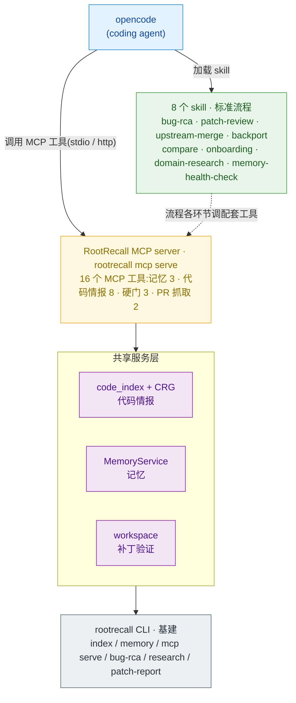

# RootRecall

> *Light on every root cause.*

**给系统软件代码库(C 为主,如 wpa_supplicant / bluez)做「带记忆的 bug 根因定位 + 深度调研」的领域 harness —— 记忆 + 代码情报 + 日志取证 + 补丁验证 + 标准流程 skill,作为 MCP tool/skill server 供 opencode 调用。** RootRecall 不自行调度 coding agent 执行固定管线;读码、改代码等重活由 opencode 承担,RootRecall 负责召回与组装精确上下文、提供工具和标准流程、沉淀并检索记忆。

## 能做什么:8 个 skill

按问题形态选择 skill。每个 skill 定义一套标准流程,流程各环节均有配套 MCP 工具:

| 问题形态 | skill | 产出 |
|---|---|---|
| "为什么 X 会断 / 泄漏 / 死锁",查 bug / 崩溃 / 回归 / CVE 根因 | `bug-rca` | 根因 + 补丁(已验 apply)+ 分析报告 + 沉淀教训 |
| "这个补丁干啥 / 能不能打上 / 该不该合" | `patch-review` | 补丁或 GitHub PR 鉴定:做了什么、能否 apply、影响面、合入建议 |
| "上游这些 commit 哪些该合 / 哪些已经修过" | `upstream-merge` | 逐 commit 三态判定(fork 已修 / 建议合 / 冲突大)+ 相关性 + 报告 |
| "v25 修了这个 bug,v20 还没修,帮我改 v20" | `backport` | 读 v25 的 fix → 语义判断 v20 是否存在同一缺陷 → 适配出 v20 补丁(已验 apply) |
| "v20、v25 在连接流程上有什么差异" | `compare` | 锚定两版流程入口,逐节点读函数体对照,输出流程级差异报告 |
| "这个仓库整体架构怎么组织 / 新人怎么上手" | `onboarding` | 结构图俯瞰模块边界 + 沿一条真实用户旅程端到端走读,输出导览报告 |
| "蓝牙协议是怎么设计的 / 帮我记个技术笔记" | `domain-research` | 联网检索权威源交叉印证,把领域知识写入记忆(后续 recall 自动带出) |
| "记忆库质量怎么样 / 这个仓都记了些啥" | `memory-health-check` | 全量记忆逐条审计(溯源 / 置信度 / 时效 / 矛盾),输出健康信号与建议 |

易混问题的判据(upstream-merge vs backport、compare vs backport 等)见 [docs/skill-routing-matrix.md](docs/skill-routing-matrix.md)。

8 个 skill 构建在三项共享能力之上:**代码情报**(结构图 + 向量索引 + 调用链)、**记忆**(带溯源、可纠正、持续学习的知识库)、**标准流程**(skill + 工具 + 硬门)。三者共享同一个 MCP server,任何 agent 均可使用。

## 快速开始

```bash
git clone https://github.com/TuNaiChao/RootRecall.git
cd RootRecall
bash scripts/quickstart.sh
```

脚本依次做五件事,可重复执行(已配置的部分自动跳过):

1. 装系统工具 + Python 依赖(调 `scripts/setup.sh`,Linux/macOS 自适应;已装过则跳过,`--force` 重装);
2. 交互填写 `.env` 密钥(必填 2 个:DeepSeek LLM + DashScope embedding/reranker;输入不回显,不打印值);
3. 验证模型配置(`rootrecall models`);
4. (可选)给目标代码库建索引 —— 检索类工具需要,记忆类不需要;
5. opencode 接线自检 + 启动指引。

## 在 opencode 里使用

脚本跑完后,在本仓库根目录启动 `opencode` 即可:

- 仓库根的 `opencode.json` 软链到 [config/opencode_rootrecall.json](config/opencode_rootrecall.json)(单一配置源,修改只改后者)—— 注册 rootrecall MCP、放行 `rootrecall*` 工具、内置 `rootrecall-bug-rca` 等 10 个 agent block;
- 8 个 skill 在 [.claude/skills/](.claude/skills/),opencode 自动发现;
- **必须从本仓库根目录启动** —— MCP command 用 `uv run` 按 cwd 解析 `.venv`,skill 从 `.claude/skills/` 发现,`.env` 由 rootrecall 进程启动时自行加载,均不依赖 shell 环境变量。

试用(在 opencode 里直接问):

- 「为什么 wpa 的 P2P 会话会泄漏?」→ `bug-rca`
- 「这个仓库整体架构怎么组织?新人怎么上手?」→ `onboarding`

多仓库支持:检索 / 记忆类工具均接受 per-call `codebase` 参数,建多个索引即可在多个仓之间切换;记忆全局共享,条目以 codebase 标签隔离。

## 架构



一个 MCP server、8 个 skill、16 个工具。RootRecall 不替代 opencode,只提供工具与流程。

## 16 个 MCP 工具

**记忆(3 个)**

| 工具 | 作用 |
|---|---|
| `rootrecall-memory_recall` | 检索长期记忆(bug 教训 / 代码事实 / 领域知识),带 file:line 溯源,多路召回 + 时间衰减 |
| `rootrecall-memory_memorize` | 写入记忆 / 沉淀教训;支持 `corrects` 参数显式声明"纠正了哪条旧结论" |
| `rootrecall-memory_dump` | 全量记忆分页导出为溯源卡,供体检 / 审计(只读) |

**代码情报(8 个)**

| 工具 | 作用 |
|---|---|
| `rootrecall-search_codebase` | 语义 + 符号检索,**只返回索引中真实存在的符号**(防幻觉) |
| `rootrecall-blast_radius` | 改动影响面(结构图 BFS:改这些文件会波及谁) |
| `rootrecall-call_chain` | 调用链:谁调它 / 它调谁(N 跳 CALL 边 + PageRank 排序) |
| `rootrecall-repo_map` | 全仓符号地图,按重要性打包进 token 预算(Aider 式 repo map) |
| `rootrecall-repo_overview` | 架构俯瞰:模块社区 / 边界 / 枢纽 / 桥节点 / 耦合告警(纯图查询,防幻觉) |
| `rootrecall-cross_version_diff` | 同一个仓两个 git ref 之间的差异 |
| `rootrecall-when_introduced` | 某个符号由哪个 commit 引入(pickaxe + 行历史双锚点) |
| `rootrecall-merge_eval` | 上游 commit 合入判定三态:fork 已修(patch-id)/ 建议合 / 冲突(merge-tree,零 touch) |

**硬门(交付关卡,3 个)**

| 工具 | 作用 |
|---|---|
| `rootrecall-validate_patch` | 补丁能否干净 apply(`git apply --check`,执行硬门) |
| `rootrecall-export_patch` | 把补丁落盘成 `data/bug_rca/<repo>.patch`(交付硬门;空 diff 报错) |
| `rootrecall-export_report` | 把分析报告落盘成 `data/bug_rca/<repo>-rca.md`(交付硬门;可附带蒸馏一份 AGENTS.md) |

**PR 抓取(2 个)**

| 工具 | 作用 |
|---|---|
| `rootrecall-fetch_patch` | 抓取 GitHub PR 的 diff + 元数据(标题 / 正文 / 变更文件) |
| `rootrecall-ensure_repo` | 仓库名 / URL → 本地路径,本地没有则自动 clone |

## 记忆:带溯源与纠正闭环的知识库

- **四类知识**:`codebase_fact`(代码事实,读码核实)/ `bug_lesson`(bug 教训,真机验证后才记)/ `mental_model`(经验法则,由高频教训巩固升级而来)/ `domain_knowledge`(领域知识,多权威源交叉印证或用户笔记)。
- **每条带溯源**:confidence、来源层级、evidence file:line、commit_sha、bi-temporal 双时间戳(结论过期不删除,标记为 STALE,历史可审计)。
- **纠正闭环**:新结论可显式声明纠正对象;被纠正条目降权但不隐藏,误诊记录留档可审计。
- **检索与巩固**:BM25(jieba 中文分词)+ 向量(sqlite-vec ANN)+ RRF 融合 + 时间衰减;高频条目自动巩固。

## 验证边界

系统软件的编译 / 测试 / 复现环境重、信号歧义大,RootRecall 的自动化验证**封顶在 apply**(Tier 0:补丁能在干净工作树上打上)。编译、跑测试、复现一律不做,由真机环境上的工程师完成。补丁在干净 apply 且经真机验证之前,报告只陈述推理结论,不标 tested / verified;**真机验证通过才 memorize**。

## 文档

- **skill 路由矩阵**(8 个 skill 的判据 + 易混对):[docs/skill-routing-matrix.md](docs/skill-routing-matrix.md)
- **三支柱模块分析**:bug 定位 [docs/bug-rca-module-analysis.md](docs/bug-rca-module-analysis.md) · 代码调研 [docs/code-research-module-analysis.md](docs/code-research-module-analysis.md) · 记忆 [docs/memory-module-analysis.md](docs/memory-module-analysis.md)
- **参考文档**:MCP 工具 [docs/mcp-tools.md](docs/mcp-tools.md) · 配置 [docs/configuration.md](docs/configuration.md) · CLI [docs/cli.md](docs/cli.md)
- **工作约定 + 仓库地图 + 命令**:仓库根 [CLAUDE.md](CLAUDE.md)

## 技术栈

Python 3.12 · uv 管理依赖 · LangGraph + LangChain · **mcp** SDK(MCP server,stdio + streamable-http)· tree-sitter(多语言 parser)+ clangd LSP(精确导航)+ CRG(代码结构图)+ LanceDB(code_index 向量)· **native 记忆后端**(SQLite + FTS5 + jieba 中文分词 + sqlite-vec 向量 ANN;mem0 / cognee 可换)· 多 provider 模型工厂(反射加载,加 provider 通常零代码,只改 [config/config.yaml](config/config.yaml))。

## 现状

三支柱全部落地:16 个 MCP 工具、8 个 skill 均经 opencode 真机 e2e 验证(含 wpa / bluez / sdp 真仓真数据);[example/](example/) 留有 demo1 / demo2 金标准(输入 wpa 漏洞报告 + 日志 → 补丁 + 报告)。早期的 orchestrator 型 workflow(`bug-rca` / `research` / `patch-report` CLI)降级留作参考,主线走 skill + 工具。全量 pytest 绿。
